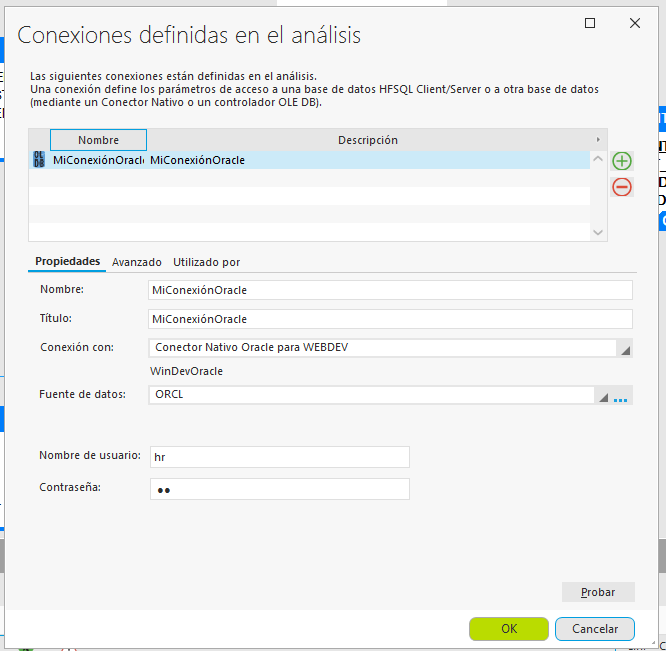

# Pasos para conectar dos maquinas virtuales e instanciar Oracle
Esta guía detalla el proceso para conectar una base de datos Oracle, instalada en una máquina virtual de CentOS, a un cliente SQL Developer que se encuentra en una máquina virtual separada de Windows 7.

Previo a iniciar se debe tener instalado el ``` SQL Developer ``` en la maquina con Windows 7
## 1. Configuración de red:
Usamos el adaptador de red en modo puente con la conexión Wi-Fi para que las máquinas virtuales se comuniquen con la red principal, las dos máquinas deben quedar iguales.


## 2. Verificación de la red:
Confirmamos que las máquinas se puedan "ver" mutuamente mediante un ping exitoso.

Buscamos la ip del servidor donde se encuentra oracle instalado:


Y le hacemos un ping desde la maquina donde se va a usar el servicio:


## 3. Configuración de firewall:
Abrimos el puerto 1521 en el firewall de la maquina oracle para permitir la conexión de la base de datos.
Se usan los siguientes comandos en la terminal:

``` 
sudo firewall-cmd --permanent --add-port=1521/tcp
```
```     
sudo firewall-cmd --reload
```

## 4. Configuración del entorno
Establecer las variables de entorno ORACLE_HOME y PATH de forma permanente en el archivo .bashrc para poder ejecutar los comandos de Oracle sin problemas en la terminal.

Sepuede abrir con el editor de texto ``` vi ``` o ``` nano ``` desde la terminal

``` 
vi ~/.bashrc
``` 

Agregamos al final del archivo las variables que necesitamos
``` 
# Oracle Environment Variables
export ORACLE_HOME=/opt/oracle/product/21c/dbhomeXE
export PATH=$ORACLE_HOME/bin:$PATH
export ORACLE_SID=XE
``` 
Presiona ``` Esc ```, luego ``` :wq ``` y ``` Enter ``` para guardar los cambios

Para que los cambios surtan efecto en tu terminal actual, ejecuta el siguiente comando:
``` 
source ~/.bashrc
``` 

## 5. Verificación del servicio:
Confirmamos que el listener de Oracle esté activo y que la base de datos esté registrada.
``` 
lsnrctl status
``` 

Si sale ``` TNS:no listener ``` es porque se debe iniciar con el siguiente comando:
``` 
lsnrctl start
``` 
Ahora que el listener está corriendo, necesitamos que la base de datos xepdb1 se registre con él para que las conexiones desde SQL Developer funcionen.
``` 
sqlplus sys/contraseñasys as sysdba
``` 
Una vez que te conectes y veas el prompt ``` SQL> ```,  ejecuta el siguiente comando:
``` 
ALTER SYSTEM REGISTER;
``` 
Deberías ver un mensaje que dice ``` System altered ``` . (Sistema alterado).

Escribe ``` exit ```  para salir de SQL*Plus.

## 6. Conectar el sql developer
En la máquina que no tiene el Oracle configurar la conexión de la siguiente manera:


# Conectar a windev
Para conectar a Windev se debe tener instalado el Oracle Instance client

## Instalación Oracle Instance Client
Tener en cuenta que nos encontramos en Windows 7 y el Windev corre a 32bits

1) Descargar Oracle instance client versión 11.2.0.4.0

``` https://www.oracle.com/database/technologies/instant-client/microsoft-windows-32-downloads.html ```

2) Descomprimir el archivo en el disco C, usar una ruta facil de refernciar por ejemplo:

``` C:\Oracle\instantclient_11_2 ```

3) Crear una variable de entorno en windows, ir a``` Panel de control > Sistema y seguridad > Sistema > Configuración avanzada del sistema > Variables de entorno``` en la sección de variables del sistema ubicar el Path darle editar y poner la ruta que se definió en el paso anterior (perferiblemente ponerla de primera seguida de ";" )

4) en la ruta definida en el paso 2 crear las siguientes carpetas y archivos:
   ``` network\admin\tnsnames.ora ```
   y dentro definir el servicio de la sigueinte manera:
```
 ORCL =
  (DESCRIPTION =
    (ADDRESS = (PROTOCOL = TCP)(HOST = AQUI_VA_LA_IP)(PORT = 1521))
    (CONNECT_DATA =
      (SERVER = DEDICATED)
      (SERVICE_NAME = xepdb1)
    )
  )
  ```
  5) Reinicia la máquina para que tome los cambios.

  ## Creación del analisis en Windev
  Crear el analisis desde la opción de nuevo analisis, defina la conexion por medio de Oracle y tenga en cuenta los datos:

  La Fuente de datos es la que definimos en el punto 4 es decir ``` ORCL ```

  

LISTO ESO ES TODO -- MERECES UN AUMENTO $$